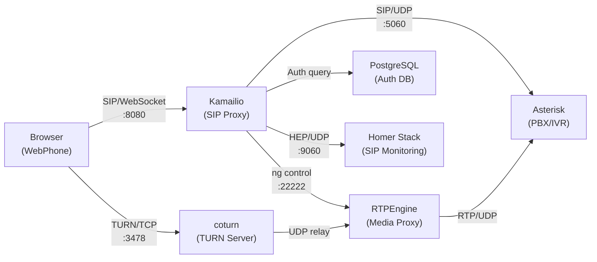

# WebRTC VoIP System - Kamailio + Asterisk + Docker

Hệ thống tổng đài VoIP hoàn chỉnh chạy trên Docker, sử dụng WebRTC để gọi điện trực tiếp từ trình duyệt.



## Tính năng

- **WebRTC Softphone** - Gọi điện trực tiếp từ trình duyệt, không cần cài phần mềm
- **Gọi giữa users** - Gọi trực tiếp giữa các extension (1000-1005)
- **IVR (Tổng đài tự động)** - Gọi 9100 để nghe menu hướng dẫn, bấm phím chuyển tiếp
- **Echo Test** - Gọi 9001 để test micro/loa
- **Music on Hold** - Gọi 9002 để nghe nhạc chờ
- **DTMF Tones** - Hiệu ứng âm thanh khi bấm phím
- **Ringtone / Busy tone** - Chuông khi có cuộc gọi đến, âm báo bận
- **SIP Monitoring** - Grafana + Homer stack để giám sát SIP traffic
- **Mute / Hold** - Tắt mic hoặc giữ cuộc gọi

## Yêu cầu

- [Docker Desktop](https://www.docker.com/products/docker-desktop/) (Windows/Mac) hoặc Docker Engine (Linux)
- Trình duyệt hỗ trợ WebRTC (Chrome, Firefox, Edge)

## Cài đặt & Chạy

```bash
# 1. Clone repo
git clone <repo-url>
cd kamailio

# 2. Khởi động tất cả services
docker compose up -d

# 3. Chờ ~30 giây để Asterisk download sound files

# 4. Mở webphone
# http://localhost:8181
```

## Sử dụng

### Đăng nhập WebPhone

Mở `http://localhost:8181` và đăng nhập với một trong các tài khoản demo:

| User | Password | Mô tả |
|------|----------|-------|
| 1000 | 1234 | User A |
| 1001 | 1234 | User B |
| 1002 | 1234 | User C |
| 1003 | 1234 | User D |
| 1004 | 1234 | User E |
| 1005 | 1234 | User F |

### Các extension có sẵn

| Extension | Chức năng |
|-----------|-----------|
| 1000-1005 | Gọi trực tiếp tới user khác |
| 9000 | Hello World + Goodbye (test) |
| 9001 | Echo Test (nghe lại giọng mình) |
| 9002 | Music on Hold (30 giây) |
| 9100 | IVR - Tổng đài tự động |

### IVR Menu (9100)

Gọi tới `9100` để nghe hướng dẫn:
- Bấm **1** - Chuyển tới Phòng Nhân sự (1001)
- Bấm **2** - Chuyển tới Phòng Kinh doanh (1002)
- Bấm **3** - Chuyển tới Hỗ trợ kỹ thuật (1003)
- Bấm **\*** - Nghe lại hướng dẫn

> Có thể bấm phím bất cứ lúc nào trong khi đang nghe hướng dẫn, không cần chờ phát xong.

### Gọi giữa 2 users

1. Mở 2 tab browser, đăng nhập 2 user khác nhau (ví dụ: 1000 và 1001)
2. Từ tab user 1000, nhập `1001` và bấm **Call**
3. Tab user 1001 sẽ hiện cuộc gọi đến, bấm **Answer**

## Services & Ports

| Service | Port | Mô tả |
|---------|------|-------|
| WebPhone | [localhost:8181](http://localhost:8181) | Giao diện softphone |
| Grafana | [localhost:3000](http://localhost:3000) | SIP monitoring (admin/admin) |
| Kamailio | 5060 (UDP/TCP) | SIP signaling |
| Kamailio | 8080 (TCP) | SIP over WebSocket |
| coturn | 3478 (TCP/UDP) | TURN server |
| PostgreSQL | 5433 | Database (kamailio/kamailiorw) |
| ClickHouse | 8123, 9000 | Homer database |

## Cấu trúc project

```
├── docker-compose.yml              # Docker stack (10 services)
├── kamailio.cfg                    # Kamailio SIP proxy config
├── kamailio-local.cfg              # Local overrides (optional)
├── asterisk/
│   ├── extensions_kamailio.conf    # Asterisk dialplan (IVR, extensions)
│   ├── pjsip_kamailio.conf        # Asterisk PJSIP config
│   └── sounds/
│       └── ivr-greeting.ulaw       # Custom IVR greeting audio
├── webphone/
│   ├── index.html                  # WebRTC softphone (SIP.js)
│   └── nginx.conf                  # Nginx config
├── db/
│   └── init.sql                    # DB schema + demo users
├── certs/
│   ├── kamailio.pem                # TLS certificate
│   └── kamailio.key                # TLS private key
├── voice1.mp3                      # IVR greeting source (MP3)
└── TROUBLESHOOTING.md              # Chi tiết troubleshooting
```

## Giám sát SIP (Homer/Grafana)

1. Mở [localhost:3000](http://localhost:3000) (admin/admin)
2. Thêm Data Source: **Loki** > URL: `http://qryn:3100`
3. Vào **Explore** > chọn **Loki** > query:
   ```
   {job="heplify-server"}
   ```

## Lưu ý kỹ thuật

### Docker Desktop Windows
Hệ thống sử dụng **coturn TURN server qua TCP** để giải quyết vấn đề Docker Desktop Windows thay đổi UDP source port (phá vỡ ICE/DTLS). Chi tiết xem [TROUBLESHOOTING.md](TROUBLESHOOTING.md).

### Linux
Chạy bình thường trên Linux. coturn vẫn hoạt động tốt dù Linux Docker không có vấn đề UDP NAT.

### Thay đổi IVR audio
```bash
# Convert MP3 sang ulaw cho Asterisk
ffmpeg -y -i your-audio.mp3 -ar 8000 -ac 1 -f mulaw asterisk/sounds/ivr-greeting.ulaw

# Reload dialplan
docker compose exec asterisk asterisk -rx "dialplan reload"
```

### Thêm user mới
```sql
-- Kết nối vào PostgreSQL
docker compose exec postgres psql -U kamailio -d kamailio

-- Thêm user (thay 1006 và password)
INSERT INTO subscriber (username, domain, password, ha1, ha1b) VALUES
  ('1006', 'localhost', 'mypass',
   MD5('1006:localhost:mypass'),
   MD5('1006@localhost:localhost:mypass'))
ON CONFLICT (username, domain) DO NOTHING;
```

## Component versions

| Component | Image | Version |
|-----------|-------|---------|
| Kamailio | kamailio/kamailio-ci:latest | 5.5+ |
| Asterisk | andrius/asterisk:latest | 22+ |
| RTPEngine | drachtio/rtpengine:latest | 9+ |
| coturn | coturn/coturn:latest | latest |
| PostgreSQL | postgres:16-alpine | 16 |
| SIP.js | (bundled in webphone) | 0.21.2 |
| Grafana | grafana/grafana-oss:10.4.3 | 10.4 |
