# WebRTC + Kamailio + Docker Desktop Windows - Troubleshooting Log

## Tổng quan hệ thống

### Kiến trúc

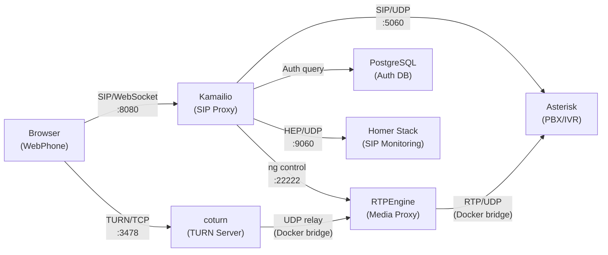

### Phiên bản các component

| Component | Image | Version |
|-----------|-------|---------|
| Kamailio | `kamailio/kamailio-ci:latest` | 5.5.2 |
| Asterisk | `andrius/asterisk:latest` | 22.8.2 |
| RTPEngine | `drachtio/rtpengine:latest` | 9.4.0.0 |
| coturn | `coturn/coturn:latest` | latest |
| PostgreSQL | `postgres:16-alpine` | 16 |
| WebPhone | SIP.js | 0.21.2 |
| Homer | heplify-server + qryn + ClickHouse + Grafana | latest |

### Docker Network

```yaml
# Fixed subnet để đảm bảo IP ổn định
networks:
  default:
    ipam:
      config:
        - subnet: 172.20.0.0/16
```

### Ports mapping

| Service | Port | Protocol | Mục đích |
|---------|------|----------|----------|
| Kamailio | 5060 | UDP/TCP | SIP signaling |
| Kamailio | 8080 | TCP | SIP over WebSocket |
| Asterisk | 5038 | TCP | AMI (Asterisk Manager) |
| coturn | 3478 | TCP/UDP | TURN server |
| PostgreSQL | 5433→5432 | TCP | Database |
| WebPhone | 8181→80 | TCP | Web UI (nginx) |
| Grafana | 3000 | TCP | Homer SIP monitoring UI |
| ClickHouse | 8123, 9000 | TCP | Homer database |
| heplify-server | 9060 | UDP/TCP | HEP capture |

---

## Cấu hình ban đầu (trước khi troubleshoot)

### RTPEngine - Dual interface với port mapping

```yaml
# docker-compose.yml (BAN ĐẦU - KHÔNG HOẠT ĐỘNG)
rtpengine:
    image: drachtio/rtpengine:latest
    ports:
      - "30000-30100:30000-30100/udp"   # RTP ports mapped ra host
    entrypoint: >
      rtpengine
        --interface=external/127.0.0.1
        --interface=internal/$(hostname -i)
        --listen-ng=0.0.0.0:22222
        --port-min=30000 --port-max=30100
```

### Kamailio NATMANAGE - Có direction flags

```
# kamailio.cfg (BAN ĐẦU)
# Dùng direction=external/internal cho dual interface
rtpengine_manage("replace-origin replace-session-connection
    direction=external direction=internal
    rtcp-mux-demux DTLS=off SDES-off ICE=remove RTP/AVP");
```

### WebPhone - SDP modifier rewrite IP

```javascript
// webphone/index.html (BAN ĐẦU)
// Rewrite Docker bridge IP → localhost để browser có thể kết nối trực tiếp
const fixDockerSDP = (description) => {
    const modified = {
        type: description.type,
        sdp: description.sdp.replace(
            /c=IN IP4 172\.\d+\.\d+\.\d+/g,
            'c=IN IP4 127.0.0.1'
        ).replace(
            /a=candidate:(\S+) 1 udp (\d+) 172\.\d+\.\d+\.\d+/g,
            'a=candidate:$1 1 udp $2 127.0.0.1'
        )
    };
    return Promise.resolve(modified);
};

// PeerConnection KHÔNG có TURN server
peerConnectionConfiguration: {
    iceServers: []   // Trống - chỉ dùng host candidates
}
```

**Vấn đề:** Cấu hình này hoạt động với giả định browser có thể kết nối trực tiếp tới RTPEngine qua `127.0.0.1:30000-30100/udp`. Nhưng Docker Desktop Windows thay đổi source port khi forward UDP → phá vỡ ICE/DTLS.

---

## Vấn đề chính: DTLS Handshake thất bại qua Docker Desktop

### Triệu chứng

- Gọi tới extension 9000, SIP signaling thành công (200 OK)
- ICE kết nối tạm thời rồi disconnect
- DTLS handshake không hoàn thành
- Không nghe được âm thanh

### Log lỗi chi tiết

```
[11:35:18 PM] Answer SDP: c=IN IP4 172.20.0.7, m=audio 30068, a=setup:passive
[11:35:18 PM] Remote ICE: a=candidate:ybdGcTcQgmSG4iF2 1 udp 2130706431 172.20.0.7 30068 typ host
[11:35:18 PM] Session state: Established
[11:35:18 PM] INVITE accepted (200 OK)
[11:35:18 PM] ICE connection: connected
[11:35:18 PM] DTLS/Connection: connecting
[11:35:18 PM] ICE pair: 172.20.0.2:49202 ↔ 172.20.0.7:30068
[11:35:18 PM] ICE pair type: local=relay remote=host
[11:35:18 PM] DTLS/Connection: connected
[11:35:29 PM] ICE connection: disconnected           ← 11 giây sau
[11:35:29 PM] DTLS/Connection: disconnected
[11:35:39 PM] DTLS/Connection: failed
[11:35:39 PM] DTLS FAILED - handshake did not complete through Docker NAT
```

### Nguyên nhân gốc

Docker Desktop trên Windows sử dụng kiến trúc nhiều lớp NAT cho UDP:

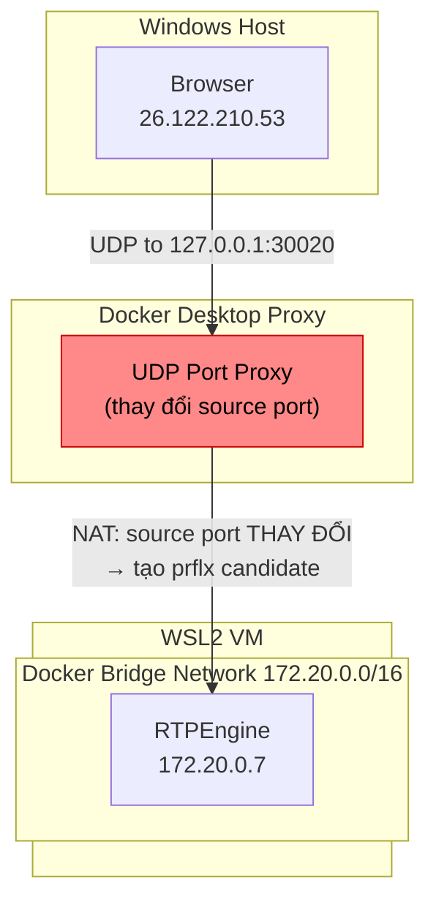

**Chi tiết kỹ thuật:**

1. Browser gửi STUN tới `127.0.0.1:30020`
2. Docker Desktop proxy chuyển tiếp tới container nhưng **thay đổi source port**
3. ICE thấy response từ port khác → tạo **peer-reflexive (prflx) candidate**
4. Browser gửi DTLS tới prflx port → port này **không có trong Docker mapping** → DTLS thất bại

```
ICE pair: 26.122.210.53:62472 ↔ :62476      ← port 62476, không phải 30020!
ICE pair type: local=host remote=prflx        ← peer-reflexive, không phải host
DTLS FAILED
```

---

## Các giải pháp đã thử (theo thứ tự thời gian)

### Giải pháp 1: RTPEngine `network_mode: host`

**Thay đổi:**
```yaml
# docker-compose.yml
rtpengine:
    network_mode: host
    # Bỏ ports mapping (host mode dùng trực tiếp)
```

```
# kamailio.cfg
modparam("rtpengine", "rtpengine_sock", "udp:host.docker.internal:22222")

# Thêm extra_hosts cho Kamailio container
extra_hosts:
  - "host.docker.internal:host-gateway"
```

**Vấn đề 1a - IPv6 hostname:**
```bash
# hostname -i trong host-mode container trả về IPv6
$ hostname -i
fdc4:f303:9324::7    # ← IPv6, không dùng được!

# Fix: lọc lấy IPv4
$ hostname -I | tr ' ' '\n' | grep -v ':' | head -1
192.168.65.254       # ← IPv4
```

**Vấn đề 1b - host.docker.internal không forward UDP:**
```
# host.docker.internal resolve tới 192.168.65.254
# Đây là gateway WSL2 VM, KHÔNG forward UDP tới host-mode container
# → rtpengine_sock timeout
```

**Vấn đề 1c - Đổi sang Docker bridge gateway:**
```
# Dùng 172.20.0.1 (bridge gateway) thay vì host.docker.internal
modparam("rtpengine", "rtpengine_sock", "udp:172.20.0.1:22222")
# → Control channel OK, nhưng media vẫn fail
```

**Bằng chứng quyết định - RTPEngine ICE log (host mode):**
```
# RTPEngine gửi STUN từ 127.0.0.1 tới external IPs → không route được!
ICE candidate pair 127.0.0.1:xxxxx ↔ 26.122.210.53:xxxxx
# 127.0.0.1 là loopback, không thể route tới IP bên ngoài
# → Host mode KHÔNG THỂ hoạt động trên Docker Desktop Windows
```

**Kết quả:** ❌ DTLS vẫn fail

| Bước | Thay đổi | Kết quả |
|------|----------|---------|
| 1a | `network_mode: host` | `hostname -i` trả về IPv6 |
| 1b | Fix IPv4 + `host.docker.internal` | Control channel timeout |
| 1c | Đổi sang `172.20.0.1` | Control OK, media fail |
| 1d | Kiểm tra RTPEngine logs | STUN từ 127.0.0.1 → không route được |

---

### Giải pháp 2 (cuối cùng): TURN Server (coturn) qua TCP

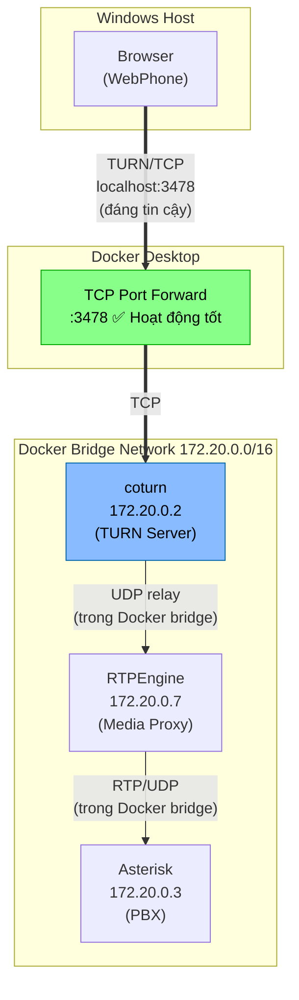

**Tại sao hoạt động:**

1. **TCP forwarding** qua Docker Desktop hoạt động hoàn hảo (không có vấn đề UDP NAT)
2. Browser kết nối TURN qua TCP (`turn:localhost:3478?transport=tcp`)
3. coturn relay media bằng UDP **trong Docker bridge** (không qua Docker Desktop proxy)
4. RTPEngine và Asterisk giao tiếp trực tiếp trong Docker bridge
5. `iceTransportPolicy: 'relay'` buộc browser chỉ dùng TURN relay, bỏ qua host candidates

**Các thay đổi cần thiết:**

1. **Thêm coturn** vào docker-compose.yml
2. **Revert RTPEngine** về bridge mode, single interface (bỏ host mode, bỏ dual interface)
3. **Revert kamailio.cfg** `rtpengine_sock` về `udp:rtpengine:22222`, bỏ direction flags
4. **Update webphone** - thêm TURN config, bỏ SDP modifier, thêm `iceTransportPolicy: 'relay'`

### Cấu hình chi tiết (SAU KHI FIX)

**docker-compose.yml - coturn:**
```yaml
coturn:
    image: coturn/coturn:latest
    ports:
      - "3478:3478/tcp"    # TCP - hoạt động tốt qua Docker Desktop
      - "3478:3478/udp"
    command:
      - |
        RELAY_IP=$(hostname -i)
        exec turnserver \
          --listening-port=3478 \
          --listening-ip=0.0.0.0 \
          --relay-ip=$RELAY_IP \
          --min-port=49152 --max-port=49252 \
          --lt-cred-mech --user=webrtc:webrtc \
          --realm=localhost \
          --fingerprint \
          --no-tls --no-dtls \
          --allowed-peer-ip=172.16.0.0-172.31.255.255 \
          --allowed-peer-ip=10.0.0.0-10.255.255.255 \
          --allowed-peer-ip=192.168.0.0-192.168.255.255 \
          --verbose
```

> **Lưu ý:** `--no-tls --no-dtls` chấp nhận được trong môi trường dev local. Production cần bật TLS.

**docker-compose.yml - RTPEngine:**
```yaml
rtpengine:
    # Single interface trên Docker bridge (không cần external/internal)
    entrypoint: >
      rtpengine --interface=$(hostname -i) --listen-ng=0.0.0.0:22222
        --port-min=30000 --port-max=30100
        --log-level=7 --foreground --log-stderr --delete-delay=0
```

**kamailio.cfg - NATMANAGE:**
```
# rtpengine_sock - dùng Docker service name (bridge mode)
modparam("rtpengine", "rtpengine_sock", "udp:rtpengine:22222")

# Không cần direction flags (single interface)
# → Asterisk (plain RTP)
rtpengine_manage("replace-origin replace-session-connection
    rtcp-mux-demux DTLS=off SDES-off ICE=remove RTP/AVP");

# → Browser (WebRTC)
rtpengine_manage("replace-origin replace-session-connection
    rtcp-mux-offer generate-mid DTLS=passive SDES-off ICE=force RTP/SAVPF");
```

**webphone - PeerConnection config:**
```javascript
// SDP modifier: no-op (TURN relay handles Docker networking)
const fixDockerSDP = (description) => {
    return Promise.resolve(description);
};

// PeerConnection với TURN server
peerConnectionConfiguration: {
    iceServers: [{
        urls: 'turn:localhost:3478?transport=tcp',
        username: 'webrtc',
        credential: 'webrtc'
    }],
    iceTransportPolicy: 'relay'  // Bắt buộc dùng TURN, bỏ host candidates
}
```

---

## Vấn đề phụ 1: coturn `403 Forbidden IP`

### Triệu chứng
TURN allocation thành công nhưng `CREATE_PERMISSION` bị reject:
```
ALLOCATE processed, success
CREATE_PERMISSION processed, error 403: Forbidden IP
```

> **Lưu ý:** coturn gửi `401 Unauthorized` trước khi `ALLOCATE` thành công là bình thường - đây là TURN authentication flow (challenge-response).

### Nguyên nhân
1. SDP modifier trong webphone rewrite `172.20.0.7` → `127.0.0.1`
2. Browser tạo TURN permission cho `127.0.0.1` → coturn block loopback
3. Ngay cả không rewrite, coturn mặc định block private IPs (172.16.0.0/12)

### Giải pháp
1. **Bỏ SDP modifier** - không cần thiết khi dùng TURN (đổi thành no-op `return Promise.resolve(description)`)
2. **Thêm `--allowed-peer-ip`** cho coturn để cho phép Docker bridge IPs:
   ```
   --allowed-peer-ip=172.16.0.0-172.31.255.255
   --allowed-peer-ip=10.0.0.0-10.255.255.255
   --allowed-peer-ip=192.168.0.0-192.168.255.255
   ```

---

## Vấn đề phụ 2: Extension 9002 (Music on Hold) không có tiếng

### Nguyên nhân
Asterisk chỉ download **core sounds** (hello-world, vm-goodbye) mà không download **MoH sound package**.

### Giải pháp
Thêm download MoH vào Asterisk entrypoint:
```bash
mkdir -p /var/lib/asterisk/moh
cd /var/lib/asterisk/moh
curl -skL https://downloads.asterisk.org/pub/telephony/sounds/asterisk-moh-opsound-ulaw-current.tar.gz | tar xzf -
```

---

## Vấn đề phụ 3: Các lỗi nhỏ khác

### `tar xz` silent failure
```bash
# SAI - có thể fail khi đọc từ stdin pipe
curl -skL ... | tar xz

# ĐÚNG - dùng -f - để chỉ định đọc từ stdin
curl -skL ... | tar xzf -
```

### `docker compose restart` không áp dụng thay đổi entrypoint
```bash
# SAI - restart chỉ stop/start container hiện tại, không recreate
docker compose restart asterisk

# ĐÚNG - recreate container để áp dụng thay đổi trong docker-compose.yml
docker compose up -d --force-recreate asterisk
```

### Git Bash path translation trên Windows
```bash
# Git Bash tự động translate /var/lib/... thành C:/Program Files/Git/var/lib/...
# Fix: dùng double slash
//var/lib/asterisk/moh

# Hoặc tốt hơn: chạy command bên trong container thay vì từ Git Bash
docker exec -it asterisk ls /var/lib/asterisk/moh
```

### Kamailio startup warnings (informational, không ảnh hưởng)
```
WARNING: <core> [core/socket_info.c:1011]: fix_socket_list(): can't find any ...outbound...
WARNING: <core> [core/socket_info.c:1011]: nonce-count ...
```
Các warning này là bình thường khi module `outbound` không được load hoặc khi một số tính năng không được cấu hình.

### Docker Compose `version` obsolete
```yaml
# Warning: docker-compose.yml 'version: 3.8' is obsolete
# Có thể bỏ dòng version đi, không ảnh hưởng chức năng
```

---

## SIP Call Flow chi tiết

### REGISTER Flow

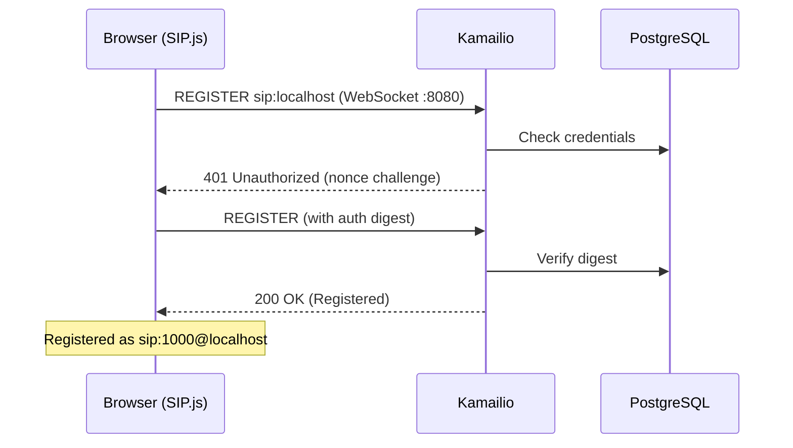

### INVITE Flow (gọi extension 9000)

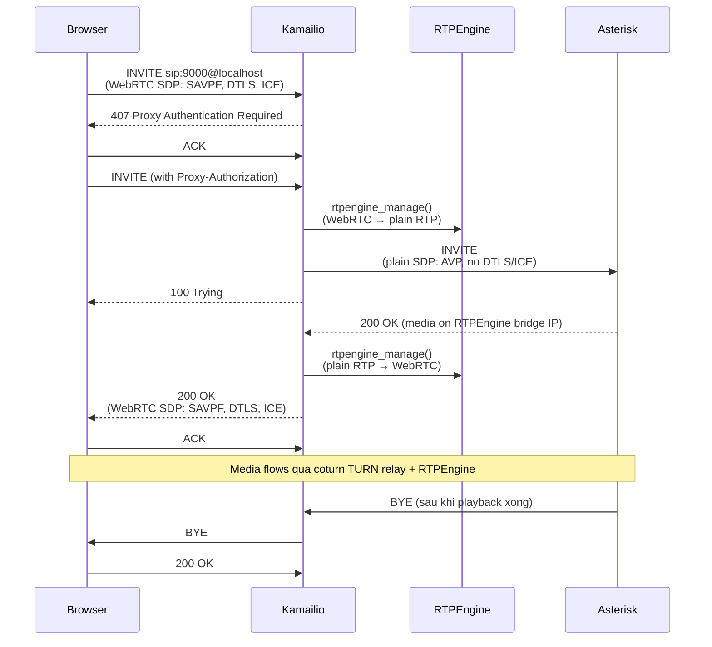

---

## Kết quả cuối cùng

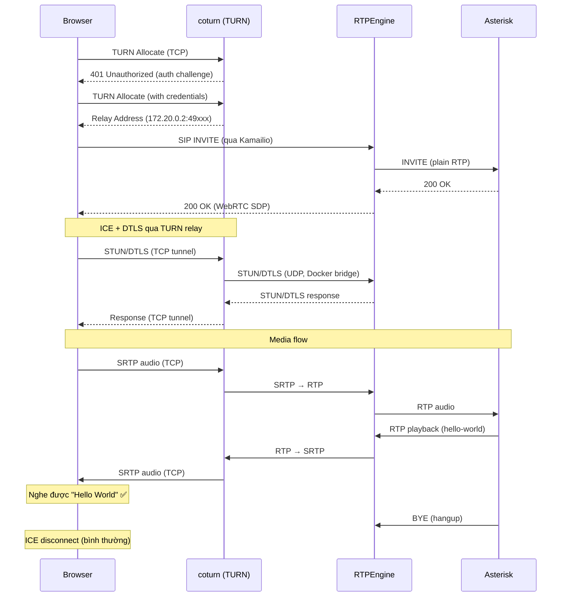

### Trạng thái hoạt động

| Extension | Chức năng | Trạng thái |
|-----------|-----------|------------|
| 9000 | Hello World + Goodbye | ✅ Hoạt động |
| 9001 | Echo Test | ✅ Hoạt động |
| 9002 | Music on Hold (30s) | ✅ Hoạt động (sau khi thêm MoH sounds) |

### Bài học rút ra

1. **Docker Desktop Windows + WebRTC UDP = không đáng tin cậy** - UDP port forwarding qua Docker Desktop proxy thay đổi source port, phá vỡ ICE/DTLS
2. **TURN/TCP là giải pháp** - TCP forwarding qua Docker Desktop hoạt động hoàn hảo
3. **Giữ media trong Docker bridge** - Tất cả UDP media nên nằm trong Docker internal network
4. **`iceTransportPolicy: 'relay'`** - Buộc browser chỉ dùng TURN, tránh host candidates không thể route
5. **`docker compose restart` ≠ `docker compose up --force-recreate`** - restart không áp dụng thay đổi config
6. **`hostname -i` có thể trả IPv6** trong host-mode containers - cần filter cho IPv4
7. **coturn block private IPs by default** - cần `--allowed-peer-ip` cho Docker bridge ranges
8. **SDP modifiers có thể gây conflict** với TURN - nên bỏ khi dùng relay

---

## Vấn đề phụ 4: Gọi user 1001 bị 500 Internal Server Error

### Triệu chứng
Gọi từ 1000 tới 1001 nhận được `500 Internal Server Error`.

### Nguyên nhân
Module `nathelper` và `registrar` cần chia sẻ cùng `received_avp`, nhưng param bị khai báo sai hoặc thiếu.

### Sơ đồ

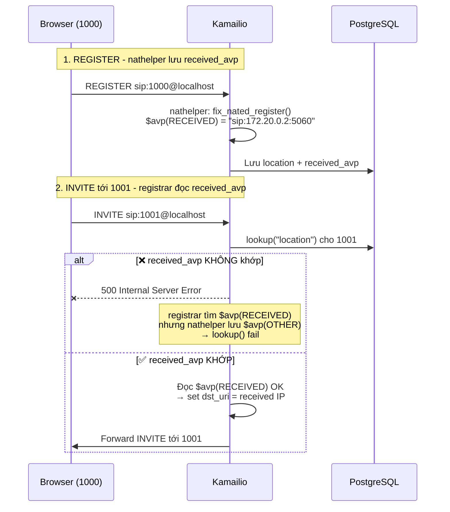

### Giải pháp
Đảm bảo cả hai module dùng chung `received_avp`:
```
modparam("nathelper|registrar", "received_avp", "$avp(RECEIVED)")
```

> **Lưu ý:** Nếu khai báo riêng lẻ cho từng module, phải đảm bảo giá trị giống nhau. Nếu không, `lookup("location")` sẽ fail khi xử lý NAT.

---

## Vấn đề phụ 5: IVR không có âm thanh (Asterisk → Browser)

### Triệu chứng
Gọi tới 9000/9100, SIP signaling thành công (200 OK), nhưng không nghe được audio từ Asterisk.

### Nguyên nhân
Kamailio listen socket không có `advertise`, khiến Record-Route và Via header chứa container IP (`172.20.0.x`) thay vì hostname. Các component khác không route được tới IP nội bộ.

### Sơ đồ

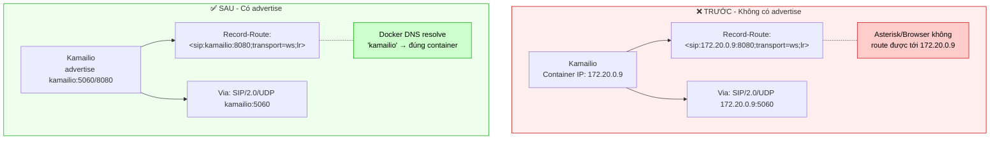

### Giải pháp
Thêm `advertise` cho tất cả listen socket:
```
listen=udp:0.0.0.0:5060 advertise kamailio:5060
listen=tcp:0.0.0.0:5060 advertise kamailio:5060
listen=tcp:0.0.0.0:8080 advertise kamailio:8080
```

Và thêm alias:
```
alias="localhost"
alias="kamailio"
```

> **Quan trọng:** Sau khi thay đổi listen/advertise, cần `docker compose restart kamailio` để áp dụng.

---

## Vấn đề phụ 6: BYE không propagate - Direct call (478 Unresolvable Destination)

### Triệu chứng
Khi A gọi trực tiếp B (1000→1001), một bên cúp máy nhưng bên kia không tự cúp theo. Kamailio log hiển thị `478 Unresolvable destination` cho BYE.

### Nguyên nhân
WebSocket client (SIP.js) sử dụng Contact domain dạng `.invalid` (ví dụ: `sip:1000@abc123.invalid`). Khi BYE được gửi trong dialog, R-URI chứa domain `.invalid` này mà Kamailio không thể resolve.

Có 2 vấn đề:
1. `set_contact_alias()` trong reply handler bị guard bởi `is_first_hop()` → không thêm `;alias=` param vào Contact cho reply
2. Không có fallback khi `handle_ruri_alias()` fail cho domain `.invalid`

### Sơ đồ

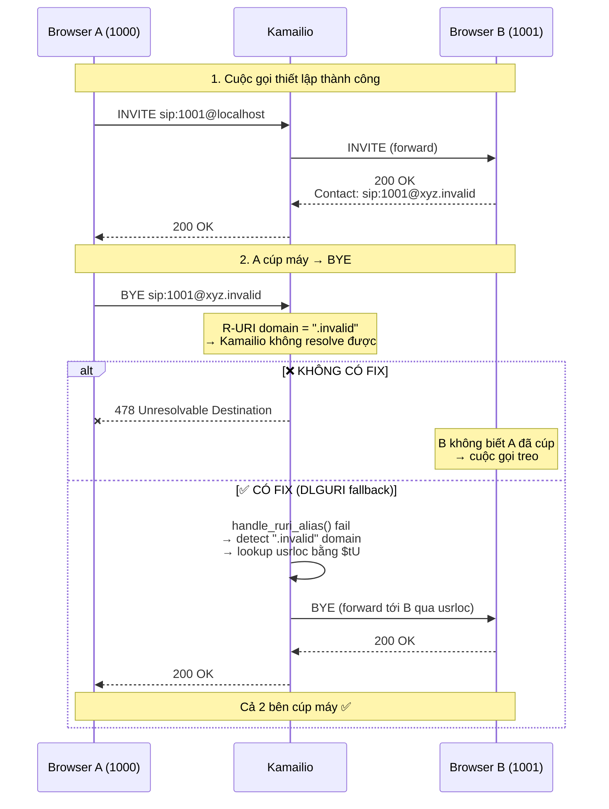

### Giải pháp

**Fix 1 - Bỏ `is_first_hop()` check trong reply handler (NATMANAGE):**
```
# TRƯỚC (lỗi):
if (is_reply()) {
    if(isbflagset(FLB_NATB) || nat_uac_test("64")) {
        if(is_first_hop()) {  # ← Guard này ngăn set_contact_alias cho reply
            set_contact_alias();
        }
    }
}

# SAU (fix):
if (is_reply()) {
    if(isbflagset(FLB_NATB) || nat_uac_test("64")) {
        set_contact_alias();  # Luôn thêm alias cho NATted reply
    }
}
```

**Fix 2 - Thêm usrloc fallback trong route[DLGURI]:**
```
route[DLGURI] {
    if(!isdsturiset()) {
        handle_ruri_alias();
    }
    # Fallback: nếu R-URI có domain .invalid và không có dst_uri,
    # tra cứu usrloc bằng To-URI username
    if(!isdsturiset() && $rd =~ "\.invalid$") {
        xlog("L_INFO", "DLGURI: .invalid R-URI ($ru), looking up $tU via usrloc\n");
        $var(orig_ruri) = $ru;
        $ru = "sip:" + $tU + "@localhost";
        if(!lookup("location")) {
            $ru = $var(orig_ruri);
            xlog("L_ERR", "DLGURI: usrloc fallback failed for $tU\n");
        }
    }
    return;
}
```

---

## Vấn đề phụ 7: BYE không propagate - IVR call (483 Too Many Hops / Routing Loop)

### Triệu chứng
Gọi qua IVR (9100 → bấm phím → forward tới user), khi một bên cúp máy, bên kia không cúp theo. Kamailio log hiển thị:
```
code=483;reason=Too Many Hops;src_ip=172.20.0.9
```
BYE bị forward vòng lặp giữa Kamailio với chính nó cho đến khi Max-Forwards hết.

### Nguyên nhân gốc
Khi Kamailio bridge WebSocket↔UDP (Browser↔Asterisk), `record_route()` tạo Record-Route entry chứa `transport=ws` từ socket WS:
```
Record-Route: <sip:kamailio:8080;transport=ws;lr>
```

Khi Asterisk gửi BYE chứa Route header này, `loose_route()` xử lý nhưng tạo ra **double Record-Route nội bộ** (parameter `r2=on`). Destination URI sau `loose_route()` trỏ về chính Kamailio với IP container:
```
dst_uri = sip:172.20.0.9:5060;lr;r2=on;nat=yes
```

Vấn đề: `loose_route()` không nhận ra URI với IP `172.20.0.9` là "myself" (chỉ nhận hostname `kamailio` qua alias). Kết quả: BYE bị forward lại Kamailio → loop.

### Sơ đồ - Luồng lỗi (TRƯỚC KHI FIX)

```mermaid
sequenceDiagram
    participant B as Browser (1000)
    participant K as Kamailio
    participant A as Asterisk (IVR 9100)
    participant U as Browser (1001)

    Note over B,U: 1. Browser gọi IVR, IVR forward tới 1001
    B->>K: INVITE 9100 (WebSocket)
    K->>A: INVITE 9100 (UDP)
    Note over A: IVR: bấm 1 → Dial 1001
    A->>K: INVITE 1001 (new call leg)
    K->>U: INVITE 1001 (WebSocket)
    U-->>K: 200 OK
    K-->>A: 200 OK
    Note over A: Asterisk B2BUA bridges 2 legs

    Note over B,U: 2. Browser A cúp máy → BYE qua Asterisk
    B->>K: BYE
    K->>A: BYE (leg 1)
    A->>K: BYE (leg 2)<br/>Route: sip:kamailio:8080;transport=ws;lr<br/>Route: sip:kamailio:5060;lr

    Note over K: loose_route() xử lý Route headers<br/>→ dst_uri = sip:172.20.0.9:5060;lr;r2=on

    alt ❌ KHÔNG CÓ FIX - Routing Loop
        K->>K: Forward BYE tới 172.20.0.9:5060<br/>(chính mình!)
        K->>K: Forward lại... (loop)
        K->>K: ... Max-Forwards giảm dần
        K--xA: 483 Too Many Hops
        Note over U: User 1001 không nhận BYE<br/>→ cuộc gọi treo
    else ✅ CÓ FIX - Self-referencing detection
        K->>K: $du =~ "172.20.0."<br/>→ strip dst_uri + Route
        K->>U: BYE (forward trực tiếp theo R-URI)
        U-->>K: 200 OK
        Note over B,U: Cả 2 bên cúp máy ✅
    end
```

### Sơ đồ - So sánh Record-Route

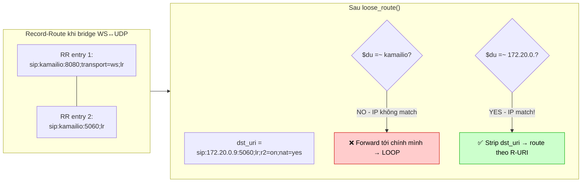

### Các cách tiếp cận đã thử

**Thử 1 - `record_route_preset()` với `;lr` trong parameter:**
```
# SAI - module tự thêm ;lr → kết quả có ;lr;lr → Asterisk PJSIP reject
record_route_preset("sip:kamailio:5060;lr", "sip:kamailio:8080;lr");
# Lỗi Asterisk: "PJSIP syntax error exception when parsing 'Record-Route' header on line 2 col 24"
```

**Thử 2 - `record_route_preset()` không có `;lr`:**
```
record_route_preset("sip:kamailio:5060", "sip:kamailio:8080");
```
Vẫn bị Asterisk PJSIP reject cùng lỗi syntax (nguyên nhân chưa xác định rõ, có thể do format header mà module tạo ra không tương thích với PJSIP).

**Thử 3 (THÀNH CÔNG) - Giữ `record_route()` + thêm self-referencing detection:**

### Giải pháp cuối cùng

Thêm kiểm tra self-referencing trong `route[WITHINDLG]` sau `loose_route()`. Điểm mấu chốt là kiểm tra cả **hostname** và **IP address** của Kamailio:

```
route[WITHINDLG] {
    if (!has_totag()) return;

    if (loose_route()) {
        # Safety net: nếu loose_route() set dst_uri trỏ về chính mình
        # (xảy ra khi transport=ws mismatch hoặc r2=on double-RR),
        # strip dst_uri để route theo R-URI thay vì loop
        if (isdsturiset()) {
            if ($du =~ "kamailio" || $du =~ "172\.20\.0\.") {
                xlog("L_INFO", "WITHINDLG: stripping self-referencing dst_uri=$du\n");
                $du = $null;
                remove_hf("Route");
            }
        }
        route(DLGURI);
        # ... rest of dialog handling
    }
}
```

**Tại sao check cũ `$du =~ "kamailio"` không hoạt động:**

`loose_route()` set `$du` dùng IP container (`172.20.0.9`) thay vì hostname `kamailio`, nên regex chỉ match hostname sẽ bỏ sót. Giá trị thực tế của `$du`:
```
sip:172.20.0.9:5060;lr;r2=on;nat=yes
```

Fix thêm pattern `172\.20\.0\.` để match IP Docker subnet.

> **Lưu ý:** Pattern IP cần điều chỉnh theo Docker subnet thực tế. Nếu đổi subnet, cần update regex tương ứng.

### Liên quan: Flags cho Asterisk routing

Để `record_route()` hoạt động đúng cho các call leg khác nhau, cần set flags **trước** `record_route()`:
```
# Trong request_route, TRƯỚC record_route:
if (is_method("INVITE")) {
    if ($rU == "9000" || $rU == "9001" || $rU == "9002" || $rU == "9100") {
        setflag(FLT_TOASTERISK);
    }
    if ($fU == "asterisk") {
        setflag(FLT_FROMASTERISK);
    }
}
```

Flags này được dùng trong `route[NATMANAGE]` để xác định hướng bridge WebRTC↔RTP cho RTPEngine.

---

## Vấn đề phụ 8: UI không đồng bộ sau khi cúp máy (Mute/Hold vẫn sáng)

### Triệu chứng
Sau khi bấm Hangup, nút Mute và Hold vẫn hiển thị active. Phải chờ ~22 giây (khi DTLS failed và session chuyển sang Terminated) UI mới reset.

### Nguyên nhân
SIP.js session có 4 states: `Establishing` → `Established` → `Terminating` → `Terminated`. Webphone chỉ xử lý `Established` và `Terminated`, bỏ qua `Terminating`. Khoảng cách giữa `Terminating`→`Terminated` có thể là 22+ giây (chờ DTLS timeout).

### Sơ đồ - SIP.js Session State Machine

```mermaid
stateDiagram-v2
    [*] --> Establishing : INVITE sent/received
    Establishing --> Established : 200 OK + ACK
    Establishing --> Terminated : Reject/Cancel

    Established --> Terminating : BYE sent/received

    Terminating --> Terminated : BYE confirmed<br/>(có thể chờ 22s nếu DTLS timeout)

    state Establishing {
        note right of Establishing
            UI: "Calling..." / "Incoming..."
            Buttons: Hangup only
        end note
    }

    state Established {
        note right of Established
            UI: "In call"
            Buttons: Mute, Hold, Hangup
        end note
    }

    state Terminating {
        note right of Terminating
            ❌ TRƯỚC: Không xử lý → UI vẫn hiện Mute/Hold
            ✅ SAU: Reset UI ngay → "Ending call..."
        end note
    }

    state Terminated {
        note right of Terminated
            UI: "Call ended"
            Buttons: Reset về trạng thái registered
        end note
    }
```

### Giải pháp
Thêm handler cho state `"Terminating"` để reset UI ngay lập tức:
```javascript
case "Terminating":
    setStatus('Ending call...', 'connecting');
    updateButtons('registered');
    if (currentSession?._statsInterval) clearInterval(currentSession._statsInterval);
    isMuted = false;
    isHeld = false;
    btnMute.textContent = 'Mute';
    btnMute.classList.remove('muted');
    btnHold.textContent = 'Hold';
    remoteAudio.srcObject = null;
    break;
```

---

## Vấn đề phụ 9: Audio play() BLOCKED warning

### Triệu chứng
Console/log hiển thị:
```
Audio play() BLOCKED: The play() request was interrupted by a new load request.
```

### Nguyên nhân
Browser autoplay policy: `remoteAudio.play()` bị gọi trước khi có media stream thực sự, hoặc bị gọi lại khi stream thay đổi.

### Sơ đồ

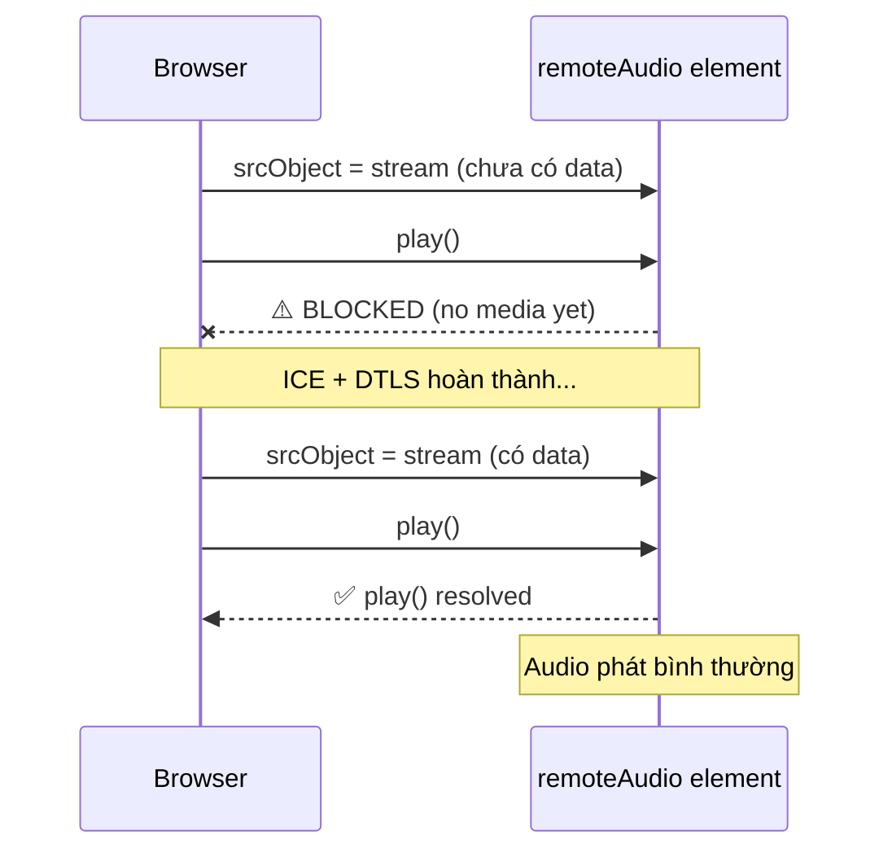

### Giải pháp
Đây là warning không nghiêm trọng. Audio vẫn phát bình thường sau khi ICE/DTLS hoàn thành. Webphone đã có retry logic:
```javascript
remoteAudio.play().then(() => {
    log('Audio element playing (play() resolved)');
}).catch(e => {
    log('Audio play() BLOCKED: ' + e.message);
});
```
Log cho thấy sau warning, `play() resolved` sẽ xuất hiện khi media sẵn sàng.

---

## Vấn đề phụ 10: DTMF không hoạt động (bấm phím trên bàn phím không gửi tone)

### Triệu chứng
Gọi tới IVR (9100), bấm phím trên keyboard nhưng IVR không phản hồi.

### Nguyên nhân
DTMF trong WebRTC được gửi qua **RFC 2833 (RTP events)** chứ không phải keyboard events. Bấm phím trên bàn phím chỉ nhập text, không gửi SIP INFO hay RTP DTMF.

### Sơ đồ

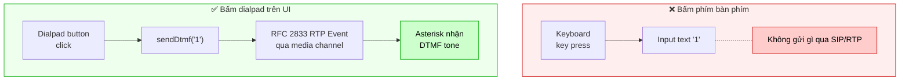

### Giải pháp
Sử dụng **dialpad trên giao diện webphone** (các nút 0-9, *, #) thay vì bàn phím. Dialpad gửi DTMF đúng cách qua `session.sessionDescriptionHandler.sendDtmf()`.

---

## Vấn đề phụ 11: Asterisk Dial() thất bại - CONGESTION / Authentication failure

### Triệu chứng
IVR nhận cuộc gọi, phát menu, nhưng khi forward tới user (ví dụ bấm 1 → Dial 1001), Asterisk báo `CONGESTION` và phát "Goodbye" ngay lập tức.

### Sơ đồ

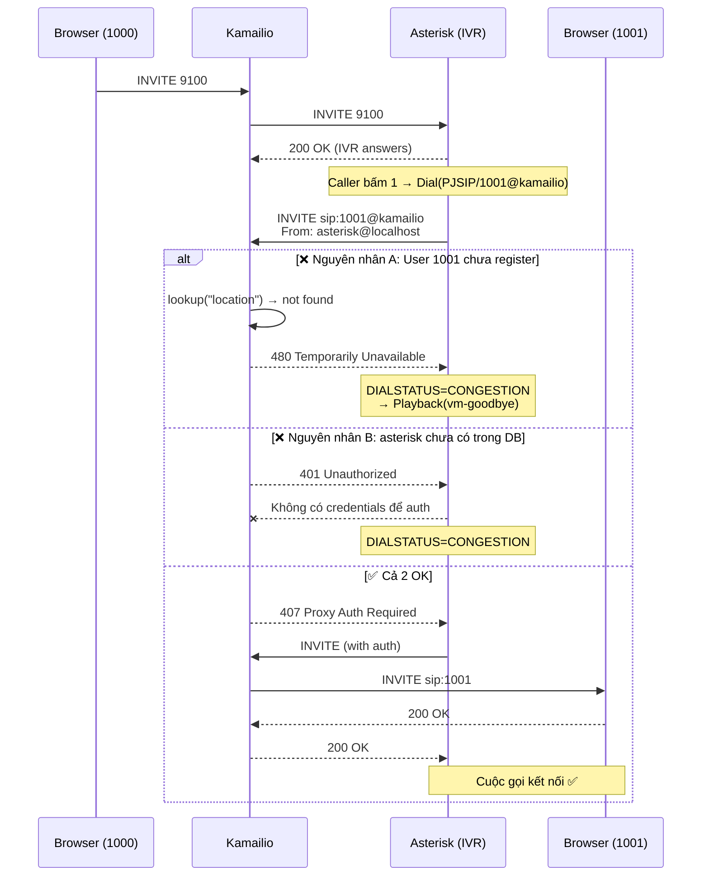

### Có 2 nguyên nhân thường gặp:

**Nguyên nhân A - User đích chưa register:**
```
-- Called 1001@kamailio
-- Got SIP response 480 "Temporarily Unavailable"
```
User 1001 chưa mở webphone hoặc chưa register. Kamailio không tìm thấy user trong usrloc.

**Fix A:** Mở tab browser thứ 2, đăng nhập user 1001 và register trước khi gọi.

**Nguyên nhân B - Asterisk chưa có account trong database:**
Asterisk gửi INVITE với `From: asterisk@localhost` nhưng Kamailio yêu cầu authentication. Nếu user `asterisk` chưa có trong bảng `subscriber` → 401 auth fail → CONGESTION.

**Fix B:** Thêm user `asterisk` vào database:
```sql
INSERT INTO subscriber (username, domain, password, ha1, ha1b) VALUES
  ('asterisk', 'localhost', 'asterisk123',
   MD5('asterisk:localhost:asterisk123'),
   MD5('asterisk@localhost:localhost:asterisk123'))
ON CONFLICT (username, domain) DO NOTHING;
```

Và cấu hình Asterisk PJSIP với credentials tương ứng trong `pjsip_kamailio.conf`.

---

## Vấn đề phụ 12: Asterisk dialplan không reload sau khi thay đổi

### Triệu chứng
Sửa file `extensions_kamailio.conf` nhưng Asterisk vẫn chạy dialplan cũ.

### Nguyên nhân
Asterisk không tự động reload config khi file thay đổi.

### Sơ đồ

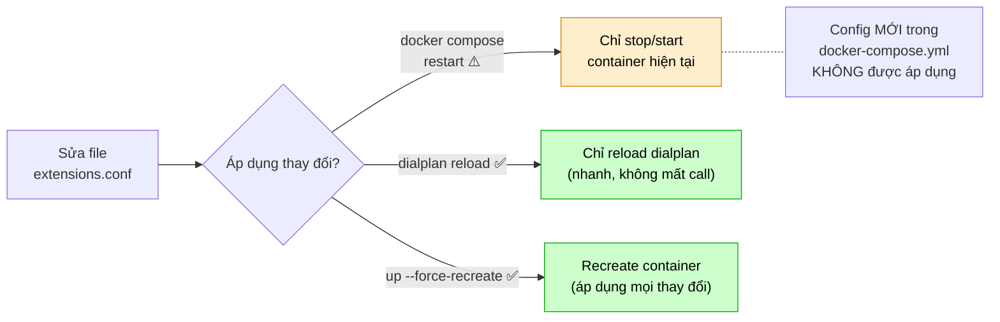

### Giải pháp
```bash
# Cách 1: Reload từ CLI
docker compose exec asterisk asterisk -rx "dialplan reload"

# Cách 2: Recreate container (áp dụng mọi thay đổi)
docker compose up -d --force-recreate asterisk

# Verify dialplan đã load:
docker compose exec asterisk asterisk -rx "dialplan show kamailio-ivr"
```

---

## Vấn đề phụ 13: `record_route_preset()` bị Asterisk PJSIP reject

### Triệu chứng
Gọi tới Asterisk extension, Asterisk log hiển thị:
```
WARNING: sip_transport.c Dropping packet from UDP 172.20.0.9:5060 :
  PJSIP syntax error exception when parsing 'Record-Route' header
  on line 2 col 24
```

### Sơ đồ

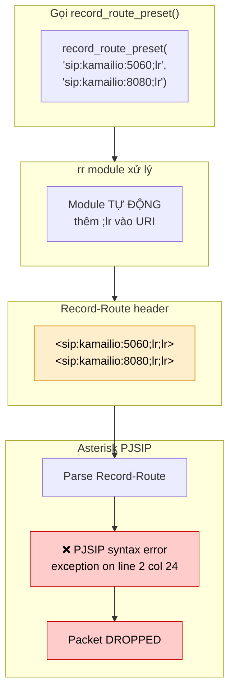

### Nguyên nhân
`record_route_preset()` của Kamailio rr module **tự động thêm `;lr`** vào URI. Nếu truyền parameter đã chứa `;lr`:
```
# SAI - tạo ra <sip:kamailio:5060;lr;lr> (double ;lr)
record_route_preset("sip:kamailio:5060;lr", "sip:kamailio:8080;lr");
```
Asterisk PJSIP không parse được `;lr;lr` → reject toàn bộ SIP message.

Ngoài ra, ngay cả khi bỏ `;lr`, format mà `record_route_preset()` tạo ra vẫn có thể bị Asterisk PJSIP reject (lý do chưa xác định chính xác - có thể liên quan đến cách module format header với 2 parameters).

### Giải pháp
Không dùng `record_route_preset()` cho calls tới Asterisk. Dùng `record_route()` bình thường kết hợp với self-referencing detection trong WITHINDLG (xem Vấn đề phụ 7).

```
# ĐÚNG - dùng record_route() tiêu chuẩn
if (is_method("INVITE|SUBSCRIBE|REFER")) {
    record_route();
}
```

---

## Vấn đề phụ 14: Thiếu SIP users trong database

### Triệu chứng
Gọi tới user nhưng nhận `404 Not Found` hoặc không register được.

### Nguyên nhân
Bảng `subscriber` trong PostgreSQL chưa có user cần thiết.

### Sơ đồ

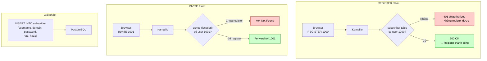

### Giải pháp
Thêm users vào database:
```sql
-- Kết nối vào PostgreSQL container
docker compose exec postgres psql -U kamailio -d kamailio

-- Thêm users (password HA1 hash cho digest auth)
INSERT INTO subscriber (username, domain, password, ha1, ha1b) VALUES
  ('1000', 'localhost', '1234',
   MD5('1000:localhost:1234'),
   MD5('1000@localhost:localhost:1234')),
  ('1001', 'localhost', '1234',
   MD5('1001:localhost:1234'),
   MD5('1001@localhost:localhost:1234')),
  ('asterisk', 'localhost', 'asterisk123',
   MD5('asterisk:localhost:asterisk123'),
   MD5('asterisk@localhost:localhost:asterisk123'))
ON CONFLICT (username, domain) DO NOTHING;
```

> **Lưu ý:** Service name trong docker-compose là `postgres`, không phải `db`. Kiểm tra bằng `docker compose ps`.

### Kiểm tra users đã register:
```bash
# Kiểm tra users trong database
docker compose exec postgres psql -U kamailio -d kamailio -c "SELECT username FROM subscriber;"

# Kiểm tra users đang online (registered)
docker compose exec kamailio kamcmd ul.dump
```

---

## Tổng hợp: Checklist khi gặp vấn đề

### Cuộc gọi không kết nối (4xx/5xx)

| Mã lỗi | Nguyên nhân thường gặp | Kiểm tra |
|---------|------------------------|----------|
| 401/407 | Auth fail | User có trong bảng `subscriber`? Password đúng? |
| 404 | User không tìm thấy | User đã register? `kamcmd ul.dump` |
| 408 | Timeout | Asterisk có nhận INVITE? Check `docker compose logs asterisk` |
| 478 | Unresolvable destination | R-URI có domain `.invalid`? DLGURI fallback hoạt động? |
| 480 | User offline | User đích đã mở webphone và register? |
| 483 | Routing loop | Kiểm tra Route header, `loose_route()`, self-referencing check |
| 500 | Server error | `received_avp` config đúng? Module loaded? |

### Media không hoạt động (không nghe được)

1. Kiểm tra coturn hoạt động: `docker compose logs coturn`
2. Kiểm tra RTPEngine: `docker compose logs rtpengine`
3. Kiểm tra ICE state trong webphone log: phải là `connected`
4. Kiểm tra DTLS state: phải là `connected`
5. Kiểm tra `advertise` trên listen sockets
6. Kiểm tra NATMANAGE flags: TOASTERISK/FROMASTERISK cho đúng hướng

### BYE không propagate (một bên cúp, bên kia không cúp)

1. Kiểm tra Kamailio log cho BYE: tìm `483`, `478`, hoặc error
2. Kiểm tra WITHINDLG self-referencing log: `stripping self-referencing dst_uri`
3. Kiểm tra DLGURI: `.invalid` domain có được handle?
4. Kiểm tra webphone `Terminating` state handler
5. Direct call vs IVR call - nguyên nhân khác nhau (xem Vấn đề 6 vs 7)
